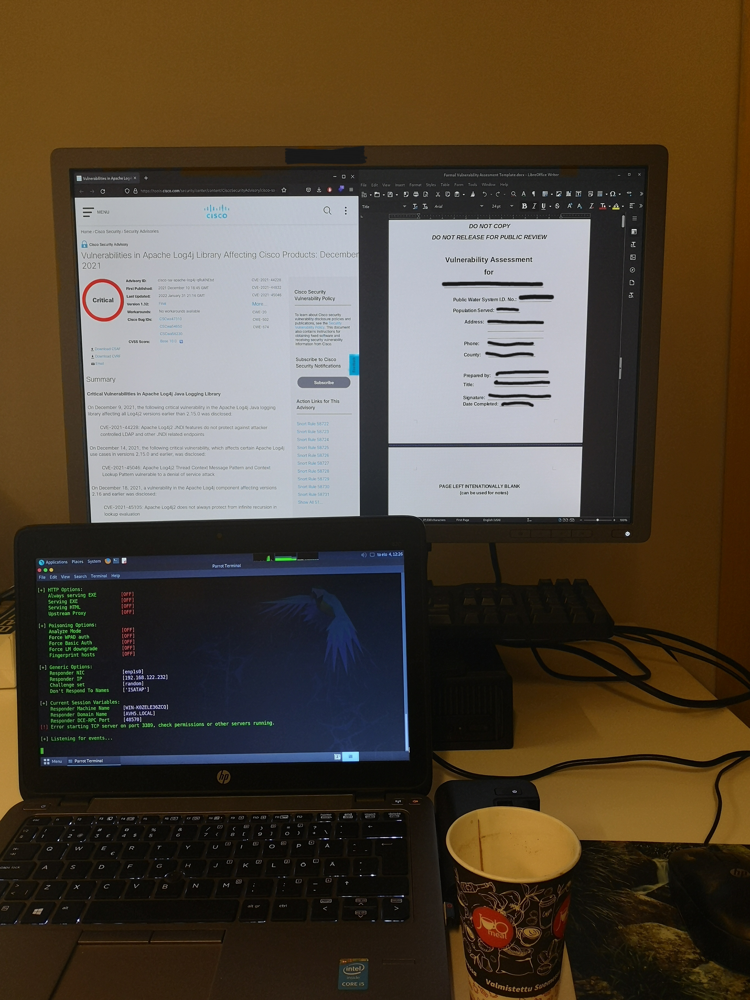
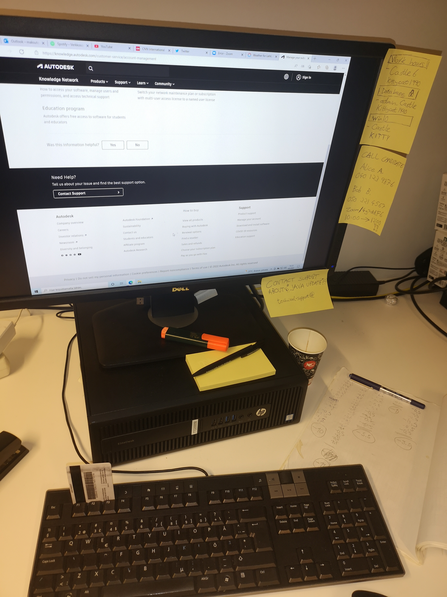

# **Week 6**

The final exercises will focus on reflecting on the relationship between privacy and social engineering. 
We also try to craft a spear-phishing message and evaluate it.

## Grading

You must do tasks **in order**.

You are expected to use more time on later tasks to get an equal amount of points than in previous tasks.

Task #|Points|Description|
-----|:---:|-----------|
[Task 1](#task-1-privacy-and-social-engineering) | 1 | Privacy and Social Engineering
[Task 2](#task-2--pretexting-prompt-engineering-and-phishing) | 2 | Pretexting, prompt engineering and phishing

##  **Task 1:** Privacy and Social Engineering

During the course, we have handled different privacy concerns in different scenarios and areas.
Sometimes, the leaked information can lead to unexpected consequences and can be also used as a part of social engineering attack. 

When performing the social engineering attack, evaluate the importance, effectiveness and some possible use cases of this information (known intelligence). 
You can note and reference psychology and related common human behavior when it is suitable.
You can use, but not limited to, the following thoughts.

1. The information you have put publicly about yourself can be used for malicious purposes. This is not limited to persons; also information about companies or other entities.
2. Performing the social engineering attack at the right time based on the known context (known package delivery, security incident, an expected message, something else?).
3. Performing the social engineering attack on a suitable platform or way based on the known habits of the target (He uses LinkedIn a lot!). 
4. The looks can deceive - something authentic looking or appealing in authentic time (physical or digital).
5. The attacker makes himself/herself more likable based on what they know about the target. 
6. The chance of ignoring the security policies when someone is likable and feels authentic. Consider impersonating with a pretext in the context of these security policies. Do people apply them to everyone equally, knowingly, all the time? (Was that police badge real??)
7. Impersonating can be even more effective in the digital world when the user does not understand how technology works or what is possible. (Deep fakes, synthetic voice, something else?). For example, there are a lot of videos and speeches available online about the target or some useful entity.

> You need to write a short essay, around 500 words. If you want, it can be longer.

## **Task 2:**  Pretexting, prompt engineering and phishing

As the last exercise assignment of the course, you need to try to perform a social engineering attack in the form of a credible phishing message. 
You also need to evaluate its performance. 

We have provided some information for the pretext.

### **Task 2A)** Thinking on your feet

As a social engineer, it is useful to quickly take notice of small details and make assumptions based on them.

Imagine you are strolling through an office space with a bunch of open workstations. You catch a glimpse of two workstations as you walk past them; **Workstation 1** and **Workstation 2**.

Workstation 1:

Workstation 2:

1. What kind of assumptions can you make about the users of these machines?
2. What is their possible occupation, operating system, personality/habits they have and what programs they use?
3. What kind of attack vectors can you identify and what other observations can you make from these snapshots?

> Pay attention to all the details. Everything can matter. You also need them in the following task!

### **Task 2B)** Prompt engineering

Prompt engineering is a relatively new term related to AI and machine learning [^1].
The main use case is to access the natural language data of Large Language Models  (LLMs) [^2].
The introduction of the ChatGPT chatbot made it as well-known term, while it might not be much different than "crafting useful Google searches".
With specially crafted prompts, you are more likely to harvest useful data from the data model or bypass (with prompt injection) its restrictions.
While the information is often obtainable in other ways, this can be more productive and effective.

You can see these resources [^3][^4] if you are more interested in prompt engineering.
It is increasingly important to understand the capabilities of these language models and what to expect.
See [Europol's statement](https://www.europol.europa.eu/publications-events/publications/chatgpt-impact-of-large-language-models-law-enforcement) about the impact of these models in criminal space.

> On this task, you need to create a spear-phishing scenario based on the information provided in the previous task.
There are multiple cases available.
As a special quirk, the message is recommended to be generated with ChatGPT.
Finally you need to test it against anti-spam engines.

Part of the assignment is to bypass some "protections" of ChatGPT to generate spear-phishing messages. 
At the moment of writing, they are straightforward to bypass.
You are allowed to write the message yourself if you don't want to use the service. 

We recommend using the [real ChatGPT](https://chat.openai.com/auth/login) for educational purposes.
As an alternative and with an older GPT model and without context, you can use [the registration-free relay](https://chatgpt.org/chat).

It is better to use a Chromium-based browser for this task, as you are required to export discussions in the end, and it has a useful extension.

1. You must give information from the previous task for ChatGPT to create the selected pretext.
2. Create the phishing message with the intended scenario with the help of the pretext.
3. You can use English or Finnish. Try to use the specific dialect (e.g. Finnish dialects) or the format in the message.(authoritative, friendly, casual, other?). Try to briefly verify whether the dialect looks somewhat correct.
3. Keep in mind that your goal is to obtain sensitive information - you can decide for yourselves what that information is.
4. We recommend that it is something more than just to get someone to reply to the message. Maybe open a link, open an attached file, or a bit longer different process.
5. You can slightly modify the message yourself.
6. Once you have finished with the message, scan it with the anti-spam tests below.
7. If it is flagged as spam, iterate a couple of times, but no need to do it endlessly.

### Anti-spam engines

Scan the email with SpamAssassin. Look for the details of the previous week to know how to do it. 
To get a realistic score, you need to send it for yourself before you can download it in `.eml` format.

Outlook and Gmail are two notorious email providers, which could be also tested.
They have their own additional close-source spam filters.
You can try one [inbox email tester](https://glockapps.com/inbox-email-tester/) to see if your emails land for these service providers. 

For sending the test emails, it is recommended to not use your main email account, just in case. 

> Once you have finished, export the ChatGPT discussions with [Chrome extension as copied text](https://chrome.google.com/webstore/detail/export-chatgpt-conversati/clgidpflecgaaabfcmdmkcgebpbadgoc) and return it. 
> Return the final crafted message.
> Provide screenshots of the spam score results.
> Was the process effective? Do you think someone could fall for your message? 

[^1]: [Prompt Engineering](https://en.wikipedia.org/wiki/Prompt_engineering)
[^2]: [Large Language Model](https://en.wikipedia.org/wiki/Large_language_model)
[^3]: [Prompt Engineering Guide](https://github.com/dair-ai/Prompt-Engineering-Guide)
[^4]: [Brex's Prompt Engineering Crash Course](https://github.com/brexhq/prompt-engineering)