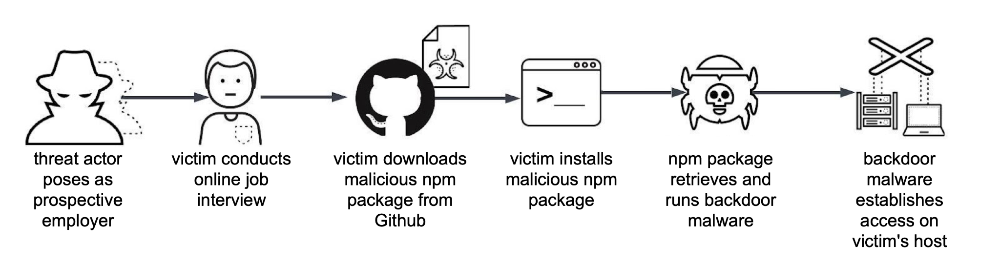

# **Week 7:** Contemporary Social Engineering Attacks and How To Prevent Them

The nature and frequency of social engineering attacks is changing and they are more commonly happening online and remote from the target. Compared to walking in to the targets building, a remote attack does not have the same fear of getting physically caught, with your own face.  
This new angle of attack utilizing deepfakes, LLMs and personal information availability for everyone is creating an increasingly more volatile environment for corporate entities, especially financial institutions.  

Exercises this week go over new types of social engineering attacks, identifying and preparing for them and handling such incidents.

## Grading

You must do tasks **in order**.

You are expected to use more time on later tasks to get an equal amount of points than in previous tasks.

The bonus task is not counted toward the course's maximum possible points; it is extra and can compensate for other work.

Task #|Points|Description|
-----|:---:|-----------|
[Task 1](#task-1-) | 1 | Deepfakes and influential people
[Task 2](#task-2-) | 1 | Shockvertising and social engineering?
[Task 3](#task-3-) | 2 | DEV#POPPER?

## **Task 1:** Deepfakes in teams calls

See [CNN news deepfake scam](https://edition.cnn.com/2024/02/04/asia/deepfake-cfo-scam-hong-kong-intl-hnk/index.html) how to train employees and stop such actions from happening in companies.  
See [BBC news deepfake scam](https://www.bbc.com/news/articles/clyvj754d9lo). ~~Take on the latter about powerful influential and/or security roles being scammed, and the potential for extortion if such happens.~~  
See [Deutsche Telekom's](https://www.telekom.com/en/company/details/share-with-care-telekom-raises-awareness-1041810) post and video at the end of the post.  

Not only do all of these have a possible negative effect on ones personal life, but they also affect the professional environment.  
How might a person act under pressure, during an attack, if they are a victim of extortion or they've been bankrupted by a fraud?  

Issues like the ones mentioned in the posts above are increasing at a rapid rate and the industry is having a tough time responding.

### **Task 1)** What it is and how to prevent the effects in a professional environment?

After going through the material, answer the following questions adding possible sources.

* When planning a social engineering attack, the first step is usually to gather intelligence. Does anything change about the intelligence gathering when considering a deepfake attack, what?

* Why do deepfake attacks have so much power and influence on employees?

* Could pure employee training prevent such attacks completely?

* How would you prevent catastrophical incidents in a work environment, what measures, processes and/or policies would you push for.  
* Are there any **existing** technical solutions? For example recognizing deepfake video or image, try atleast one and report back.  
	* What type of solution did you try?
	* Was it successful?
* How about any **possible** technical solutions, can you think of a possible new solution?  

### **Bonus Task** Deepfake? 1p

This bonus won't have any explicit guide, instead you may choose any software yourself, to create a deepfake or faceswap video.  
One such tool is the [Deep-live-cam tool](https://github.com/hacksider/Deep-Live-Cam) 

Create a video of yourself talking with a face of a celebrity, holding a piece of paper with your name on it. Upload the video or gif and then answer the questions.   

#### Questions

* What tool did you use? Is it a deepfake or faceswap tool?
* Do you think your video could fool someone?
* Was it easy?

## **Task 2:** Shockvertising/or other

## **Task 3:** Technical analysis/recreation of DEV#POPPER attack

  
[Source](https://unit42.paloaltonetworks.com/two-campaigns-by-north-korea-bad-actors-target-job-hunters/)  

How to stop 
